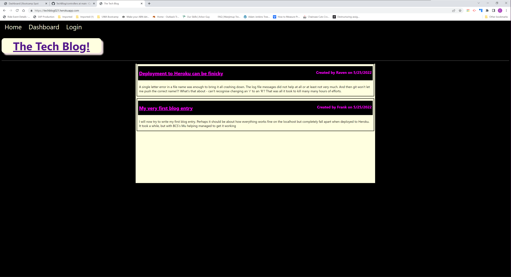
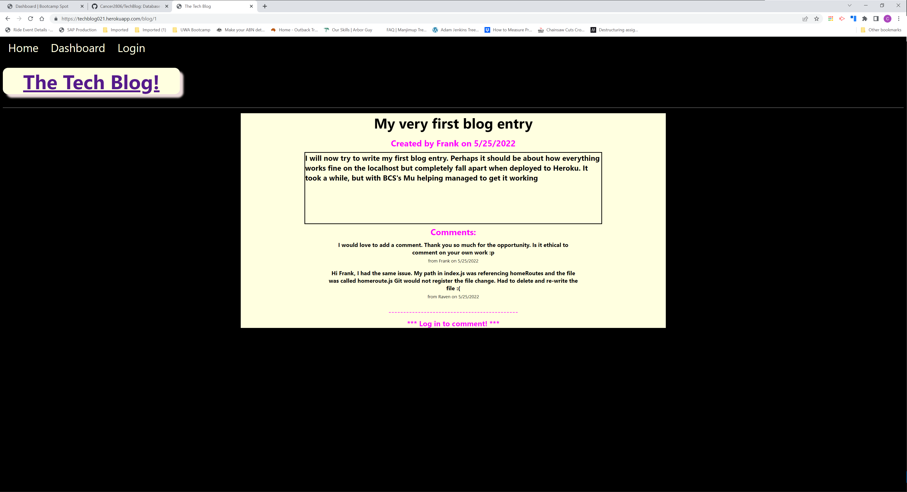
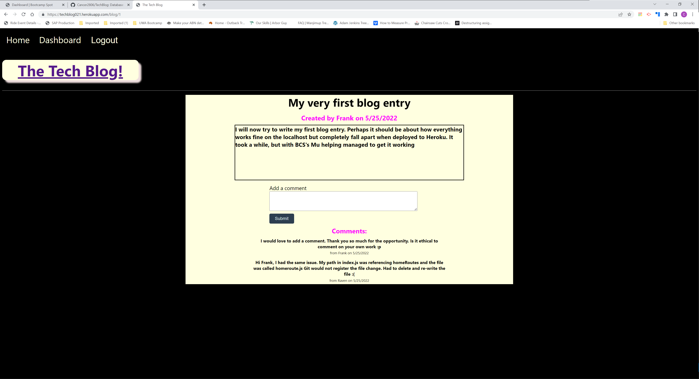
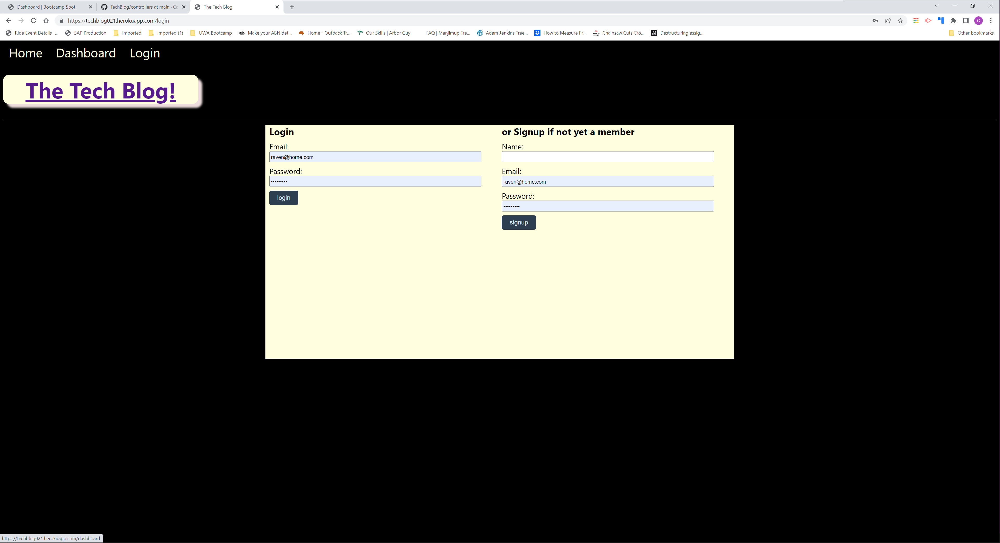
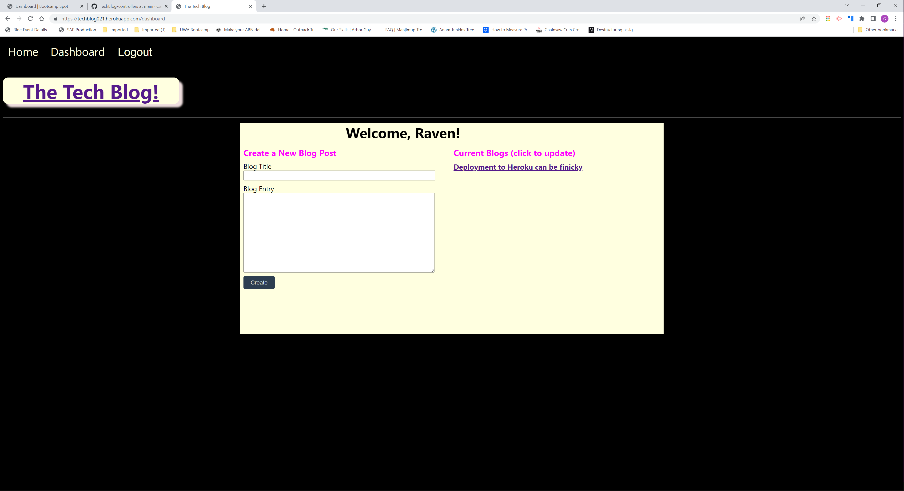

# Tech Blog  

  

## Description

The Project allows Users to write technical blogs, which other users can then comment on

 
  
## Table of Contents

- [Installation](#installation-notes)
- [Usage](#usage)
- [Features](#features)
- [Credits](#credits)
- [Contributing](#contributing)
- [Questions](#questions)
- [License](#license)

 

## Installation Notes  

  Pull from Github and maintain the folder structure.  Run npm install to ensure all of the required modules are installed.  Enter your personal database access information into the ".env.example" file and rename to ".env".  to create the database, enter mysql and from the mysql prompt type "SOURCE db/schema.sql"  Quit mysql and return to the command line interface and then seed the database using "node seeds/index.js".  Finally, start the server by typing "node server.js" at the command line - this will open a port on 3001.  You can then use the application on your localhost.  Alternativey, it can be deployed using Heroku and Kitefin.   

 

## Usage 

  The application is intuitive for users.  A User must be logged in to create a new post or to edit their existing posts.  A person visiting the site can view blog posts from others.  However, a person must be logged in to be able to leave a comment.   

  The application is deployed at:  https://techblog021.herokuapp.com/
 
   

  The Git repository for the applicaton is held at:  https://github.com/Cancer2806/TechBlog

 

  Following are screenshots showing the application in use:  

Launch Screen:
 
  
This screen lists all active blogs and can be viewed by all visitors to the Site

 

View Blog (Logged Out):
 
  
From the launch screen, a visitor to the Site can view any blog by clicking on the title   

 

View Blog (Logged In):
 
  
If a User clicks on a Blog title on the Launch screen, they are taken to the same site, with the extra option to leave a comment   

 

Log In Screen:
 
  
If a visitor is not logged in, clicking on Dashboard or Log In on the nav bar will take them to this screen.  From here, they can either register, if a new user or log in, if an existing user   

 

Bloggers Dashboard:
 
  

Once a User logs in, they are taken to their Dashboard.  From here, a User can create a new blog, or update an existing blog, by clicking on its title in the list of blogs   

 

Update Blog
 
  

If a User clicks on one of their existing blogs (title) on their Dashboard, they are taken to the Update screen.  Here the User can edit and update their blog, or remove comments which are detrimental to the Site   
 

## Features  

  The ability to manage comments left against your blog is a useful feature for controlling inappropriate content.  The site is designed to operate without a moderator.  Other features are the hashing of passwords, using Bcrypt and the ability to update previous blogs created by the User.   
 

## Credits  

  Kitefin and Heroku were used for deploying the application to the Web.  Express, Sequelize, bCrypt, Handlebars are essential dependencies for the application.  Faker was used for seeding the database during testing.   

 

## Contributing  

  Please advise by email if there are contributions you'd like to make.      

 

## Questions
Please use email for any questions you may have   

Github:  https://github.com/Cancer2806

Email:  frank.lavery@westnet.com.au

 

## License
This project is licensed under [MIT](https://opensource.org/licenses/MIT).
